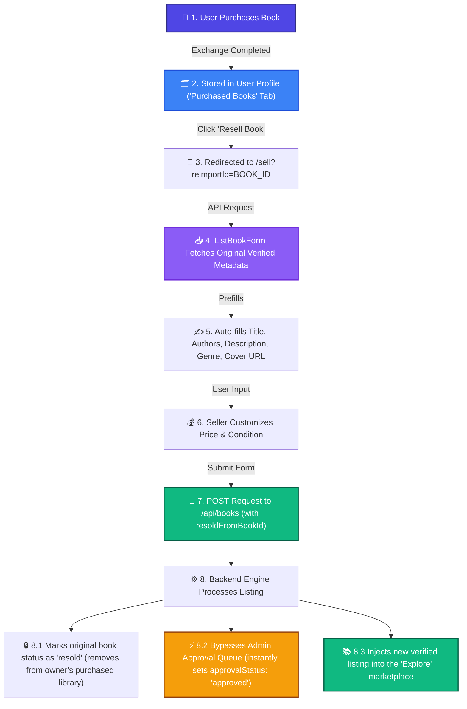

# 📚 Book Reselling & Exchange Platform (MERN Stack)

**Live Demo (Frontend):** [https://bookreselling.netlify.app](https://bookreselling.netlify.app)

This README serves as a comprehensive, end-to-end guide of the Book Reselling & Exchange Platform. By reading this document, any developer, product manager, or architect can understand and explain the complete system architecture, data models, directory structure, API endpoint definitions, and core system workflows.

---

## 🏗️ Architectural Overview
The system follows a classic **MERN (MongoDB, Express, React, Node.js) Stack** architecture.

```
       +---------------------------------------------+
       |             React Frontend (Client)         |
       |  (Vite + React Router DOM + Axios Context)  |
       +--------------------+-----------------+------+
                            |                 ^
             HTTP Requests  |                 |  JSON Responses
                            v                 |
       +--------------------+-----------------+------+
       |             Node.js / Express Server        |
       |  (REST API endpoints with JWT Auth & CORS)  |
       +--------------------+-----------------+------+
                            |                 ^
              Mongoose ORM  |                 |  Data Retrieval
                            v                 |
       +--------------------+-----------------+------+
       |                MongoDB Database             |
       |  (Users, Books, Exchanges, & Transactions)  |
       +---------------------------------------------+
```

* **Frontend Client**: Built on Vite with React, styled using custom modern CSS and Tailwind, routing via React Router DOM. It calls the backend REST API using Axios and manages shared authentication state via React Context.
* **Backend Server**: Express application running on Node.js. It registers five modular routing routers, parses JSON payloads, handles file uploads by piping them directly to Cloudinary, and uses JWT middleware for session verification.
* **Database Layer**: MongoDB Atlas database storing collections for user accounts, book listings, exchange records, and credit logs.

---

## 📂 Project Directory Structure & File Index

Below is the directory map of both the frontend and backend, explaining the specific purpose of each file:

### 🖥️ Frontend (client-side) `/frontend`
```
frontend/
├── src/
│   ├── components/            # Reusable UI widgets & layouts
│   │   ├── admin/             # Admin-specific UI elements
│   │   ├── auth/              # Auth forms and protection checks
│   │   ├── books/             # Book lists, cards, and forms
│   │   │   ├── BookCard.jsx   # Grid item card for displaying a book
│   │   │   └── ListBookForm.jsx # Unified form for listing new books or reselling purchased ones
│   │   ├── ui/                # Core base components (Buttons, Dialogs)
│   │   ├── BottomNav.jsx      # Mobile-friendly navigation header
│   │   ├── Features.jsx       # Section displaying features of the platform
│   │   ├── FloatingActionButton.jsx # Floating quick action button for listings
│   │   ├── Footer.jsx         # Bottom page site details footer
│   │   ├── Header.jsx         # Pinned sticky top header for site navigation & user menu
│   │   ├── Hero.jsx           # Landing page hero graphics and title banner
│   │   ├── HeroCarousel.jsx   # Automatic carousel for rotating highlights
│   │   ├── PageTransition.jsx # Wrapper component to handle smooth page animations
│   │   ├── PWAInstallPrompt.jsx # PWA popup prompting native installation
│   │   ├── ServiceWorkerRegister.jsx # Registers service worker for offline capabilities
│   │   ├── UserProfile.jsx    # User statistics dashboard showing listed vs purchased books
│   │   └── ValuePropositionCarousel.jsx # Showcase explaining how credit system works
│   │
│   ├── context/
│   │   └── AuthContext.jsx    # Holds current login user profile, handles login/logout and headers
│   │
│   ├── pages/                 # Route-level page components
│   │   ├── Account.jsx        # User account container wrapping profile details
│   │   ├── AdminDashboard.jsx # Admin control board showing stats, pending listings, and trade logs
│   │   ├── BookDetails.jsx    # Displays individual book details and buy request triggers
│   │   ├── Exchanges.jsx      # User dashboard showing incoming and outgoing requests
│   │   ├── Explore.jsx        # Marketplace search grid showing available books
│   │   ├── Home.jsx           # Public-facing home landing page
│   │   ├── Login.jsx          # Login portal page
│   │   ├── Sell.jsx           # Shell container for listing/reselling books
│   │   └── Signup.jsx         # User registration portal
│   │
│   ├── App.jsx                # Registers browser router, page layouts, and routes
│   ├── globals.css            # Custom CSS styles, typography variables, and Tailwind imports
│   └── main.jsx               # Entrypoint rendering React tree into document DOM
├── package.json               # Node dependency listing and start scripts
└── vite.config.js             # Vite build settings & dev server configurations
```

### ⚙️ Backend (server-side) `/backend`
```
backend/
├── middleware/
│   └── auth.js                # JWT validation middleware; decodes token and sets req.user
│
├── models/                    # Mongoose Database schemas
│   ├── Book.js                # Schema defining book details, state, and approval statuses
│   ├── Exchange.js            # Schema managing trade contracts, requester details, and fees
│   ├── Transaction.js         # Schema logging account balance credit adjustments
│   └── User.js                # Schema storing credentials, profiles, roles, and wallets
│
├── routes/                    # REST API route controllers
│   ├── admin.js               # Admin operations: approval/rejection queue, stats, and trade logs
│   ├── auth.js                # User operations: registration, login, profile updates, and active session
│   ├── books.js               # Listings: create, read, update, delete, and file upload endpoints
│   ├── exchanges.js           # Trade actions: request creations and status transitions
│   └── transactions.js        # Audit trail: retrieves personal transaction credits history
│
├── server.js                  # Main server setup: connects database, cleans database, boots routes
└── package.json               # Backend script definitions & express dependency files
```

---

## 💾 Database Schemas

### 1. User (`User.js`)
Stores user profiles, access credentials, and credit wallets.
* `displayName`: String (User name)
* `email`: String (Unique email address)
* `password`: String (Bcrypt hashed password)
* `credits`: Number (Default wallet: `100` credits)
* `booksSold`: Number (Default: `0`)
* `booksListed`: Number (Default: `0`)
* `role`: String (Enum: `['user', 'admin']`, default: `'user'`)
* `bio`, `location`, `phoneNumber`: Strings

### 2. Book (`Book.js`)
Defines the metadata of books listed for trade or resale.
* `sellerId`: ObjectId (Ref: `User`)
* `isbn`: String (International book number, default: `'N/A'`)
* `title`: String (Required)
* `authors`: Array of Strings
* `description`: String
* `credits` / `price`: Number (Credit price requested for the trade)
* `minPrice`: Number (Default: `0` for negotiation limits)
* `condition`: String (Enum: `['New', 'Like New', 'Good', 'Fair', 'Poor']`)
* `genre`: String (e.g. Fiction, History, Science)
* `coverUrl`: String (Cloudinary hosted image URL)
* `status`: String (Enum: `['available', 'sold', 'resold']`, default: `'available'`)
* `approvalStatus`: String (Enum: `['pending', 'approved', 'rejected']`, default: `'pending'`)

### 3. Exchange (`Exchange.js`)
Tracks the contract representing a transaction request between a buyer and a seller.
* `bookId`: ObjectId (Ref: `Book`)
* `bookTitle`, `bookCoverUrl`: Strings (Snapshots to preserve info if listing changes)
* `requesterId`: ObjectId (Ref: `User` - Buyer)
* `requesterName`: String
* `ownerId`: ObjectId (Ref: `User` - Seller)
* `ownerName`: String
* `status`: String (Enum: `['requested', 'accepted', 'rejected', 'cancelled']`, default: `'requested'`)
* `creditsCost`: Number (The base price of the book)
* `buyerFee`: Number (The 5% platform fee added to the buyer's cost)
* `sellerFee`: Number (The 5% platform fee subtracted from the seller's payout)

### 4. Transaction (`Transaction.js`)
Audit trail logs displaying wallet history.
* `userId`: ObjectId (Ref: `User`)
* `type`: String (Enum: `['credit', 'debit']`)
* `amount`: Number (Credits transacted)
* `description`: String (Details, e.g., "Purchased book: Hobbit")
* `relatedId`: ObjectId (Ref: `Exchange` or `Book`)

---

## 🔄 Core System Workflows

### 1. Book Reselling & Circular Economy

The platform features a fully-automated, zero-friction **Circular Economy Resell** loop. When a user buys a book, it doesn't get stuck in a silo; they can instantly list it back on the marketplace with a custom price while preserving verified metadata.



#### Step-by-Step Execution Lifecycle:
1. **Purchase Completion**: When a trade request is approved, ownership of the `Book` record is transferred, and the transaction is logged in the `Exchange` history.
2. **The Purchased Collection**: The user's account dashboard queries all completed exchanges where the user was the buyer. These display under the **"Purchased Books"** tab.
3. **Resell Initialization**: The "Resell" trigger points the client route to `/sell` with the query parameter `reimportId=...`.
4. **Metadata Auto-Import**: The listing form calls `GET /api/books/:id` using the `reimportId`. It fetches the original cover images, authors, descriptions, and ISBN numbers, eliminating manual entry.
5. **Auto-Approval Bypass Logic**: In `POST /api/books`, when `resoldFromBookId` is provided:
   * The server runs a database mutation to set the original book's `status` to `'resold'` so it cannot be double-re-listed.
   * It skips the default `'pending'` moderation state and flags the new listing as `'approved'` automatically (since the book's metadata has already been reviewed in its initial listing).


### 2. Transaction Payouts & The 5% Platform Cut
When an exchange request is **Accepted** by a seller, the backend applies the transaction fee logic:
1. **Base Cost**: Fetches the base price (`creditsCost`) of the book.
2. **Platform Cuts**: Calculates exactly 5% fee for both parties using floor arithmetic:
   $$\text{Buyer Fee} = \lfloor \text{creditsCost} \times 0.05 \rfloor$$
   $$\text{Seller Fee} = \lfloor \text{creditsCost} \times 0.05 \rfloor$$
3. **Buyer Ledger**: Debits the buyer: $\text{creditsCost} + \text{Buyer Fee}$.
4. **Seller Ledger**: Credits the seller: $\text{creditsCost} - \text{Seller Fee}$.
5. **System Revenue**: The platform keeps both cuts (10% total fee) recorded permanently in the exchange document, visible in the Admin Dashboard logs.

---

## 🌐 API Endpoint Catalog (21 Endpoints)

### 🔑 Authentication (`/api/auth`)
* `POST /register`: Registers a user, hashes password, awards 100 default credits.
* `POST /login`: Verifies password and returns JWT token.
* `GET /me`: Returns logged-in user details (requires auth).
* `PUT /profile`: Updates user profile fields (displayName, bio, location, phoneNumber).

### 📖 Books (`/api/books`)
* `POST /upload`: Uploads a cover image via Multer stream to Cloudinary and returns the hosted URL.
* `POST /`: Creates a book listing. If `resoldFromBookId` is supplied, it automatically marks the original listing as `resold` and immediately sets `approvalStatus: 'approved'`.
* `GET /`: Gets all approved & available listings (used by the Explore grid).
* `GET /user/me`: Gets all books listed by the current logged-in user.
* `GET /:id`: Gets metadata for a single book.
* `PUT /:id`: Updates a listing. If price is adjusted on an approved book, it recalculates the seller's listed credits automatically.
* `DELETE /:id`: Deletes a listing created by the caller.

### 💱 Exchanges (`/api/exchanges`)
* `POST /`: Creates a new exchange request, marked as `requested`.
* `GET /`: Gets all requests where the caller is either buyer or seller.
* `PUT /:id/status`: Updates trade status (`accepted`, `rejected`, or `cancelled`). Accepting transfers credits, subtracts 5% fees, and changes book status to `sold`.

### 💳 Transactions (`/api/transactions`)
* `GET /`: Returns the personal wallet ledger for the logged-in user.
* `POST /`: Registers manual credits adjustments.

### 👑 Admin panel (`/api/admin`)
* `GET /stats`: Returns total counts of users, books, and exchanges.
* `GET /pending-books`: Gets all book listings waiting in the approval queue.
* `POST /approve-book/:id`: Approves a book listing and awards specified credits.
* `POST /reject-book/:id`: Rejects a book listing.
* `GET /transactions`: Gets complete platform trade contracts, tracking buyers, sellers, prices, cuts, and platform revenue.

---

## ⚙️ Running Locally

### 1. Backend Setup
Create `backend/.env` file:
```env
PORT=5000
MONGODB_URI=your_mongodb_atlas_uri
JWT_SECRET=your_jwt_secret_token
CLOUDINARY_CLOUD_NAME=your_cloudinary_name
CLOUDINARY_API_KEY=your_cloudinary_key
CLOUDINARY_API_SECRET=your_cloudinary_secret
```
Start server:
```bash
cd backend
npm install
npm start
```

### 2. Frontend Setup
Create `frontend/.env` file:
```env
VITE_API_URL=http://localhost:5000/api
```
Start client:
```bash
cd ../frontend
npm install
npm run dev
```
Open [http://localhost:5173](http://localhost:5173) in your browser.
